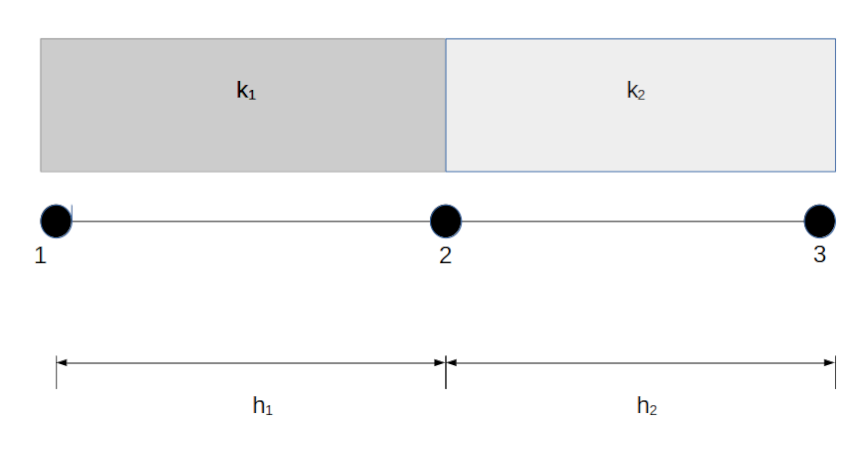

# 2023-24-ex-final. Problem 1
Consider the following problem on $[0,L]$ given by the equation

$$
-\frac{\mathrm{d}}{\mathrm{d} x}\left(k(x)\frac{\mathrm{d} u}
{\mathrm{d} x}\right) = 0,\qquad\qquad 0 < x < L
$$

where $L > 0$ and $k = k(x)$ is a function which is constant and equal to
$k_{1}$ on $\Omega^{1} = [0, h_{1})$ and constant and equal to $k_{2}$ on
$\Omega^{2} = [h_{1}, h_{1} + h_{2}]$ with $L = h_{1} + h_{2}$. Assume the
following boundary conditions

$$
u(0) = u_{0},\qquad\qquad \left[k(x)\frac{\mathrm{d}u}{\mathrm{d} x} +
 20\left(u(x) - 50\right)\right]_{x = L} = 0,
$$

with $k_{1} = 10$, $k_{2} = 20$ and $u_{0} = 200$.

We will solve the one-dimensional problem by means of a linear element at
$\Omega^{1}$ and another at $\Omega^{2}$.

(a) (3 points) Let $K$ be the stiffness matrix of the global problem. Which
is thw value of $K_{2,2}$ when $h_{1} = 0.1$ and $h_{2} = 0.2$?

* `3.0000e+02`
* Leave it empty (no penalty)
* `2.5000e+02`
* `1.5000e+02`
* `2.0000e+02`

__Hint:__ if $h_{1} = 0.2$ and $h_{2} = 0.1$ this value is `2.5000e+02`.

(b) (5 points) Assuming $h_{1} = 0.1$ and $h_{2} = 0.2$, find the
approximation $U_{3}$ of the solution $u(L)$.

* `1.4375e+02`
* Leave it empty (no penalty)
* `1.6538e+02`
* `1.5714e+02`
* `1.5000e+02`

__Hint:__ $Q_{3}$ satisfies the equation $Q_{3} + 20 (U_{3} - 50) = 0$.

(c) (2 points) Now suppose that $h_{1} = h_{2} = L/2$. Give the value of $L
= h_{1} + h_{2}$ so that $u_{3} = 120$.

* `7.6190e-01`
* Leave it empty (no penalty)
* `6.6667e-01`
* `3.3333e-01`
* `1.0000e+00`
