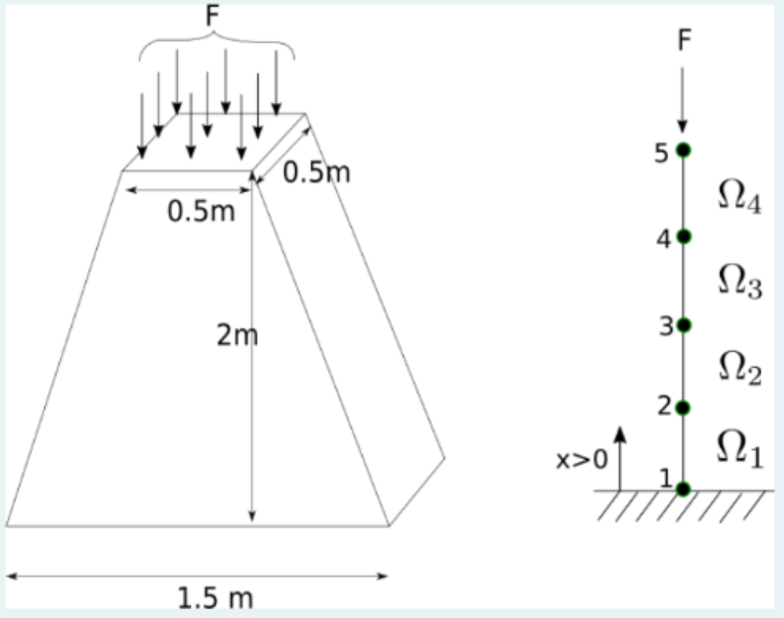

## Problema 3
A column is made of a certain material with Young modulus $R = 181\times
10^{6}\, \text{kN/m}^{2}$. The geometry of the column is shown in the
figure. We wish to analyze the column for displacements using the FEM.

The column is indeed a three-dimensional structure. However, we wish to
approximate the column as one-dimensional. To this end, we represent the
distributed force at the top of the column as a point force $F = 
5\, \text{kN}$.

The weight of the material is represented by the body force per unit
lenght:

$$
f(x) = -6.25 ( 3 - x ),\, \text{kN/m}.
$$

The governing differential equation for the problem is given by:

$$
- \frac{\text{d}}{\mathrm{d} x}\left(E A (x) \frac{\mathrm{d} u}
  {\text{d} x}\right) = f(x), 
$$

where $A(x)$ is the cross-sectional area. 
<!--

-->
<!--

-->

  

    
  

  

  

Consider a mesh with $4$ linear elements of equal length $h = 0.5\, m$.

(a) _(3 points)_ The value $K_{2,3}$ of the stiffness matrix is:

* Empty answer (no penalty)
* $\texttt{-2.0362e+08}\, \text{m}$ 
* $\texttt{-1.8326e+08}\, \text{m}$
* $\texttt{-2.2806e+08}\, \text{m}$
* $\texttt{-2.2602e+08}\, \text{m}$

(b) _(3 points)_ Compute the approximate solution $u_{\text{appr}}(x)$
at $x = 2$.

* Empty answer (no penalty)
* $\texttt{-3.5526e-07}\, \text{m}$
* $\texttt{-3.5849e-07}\, \text{m}$
* $\texttt{-3.2297e-07}\, \text{m}$ 
* $\texttt{-2.8421e-07}\, \text{m}$

__Hint:__ The approximate solution at $x = 1$ is $u_{\text{appr}}(1) =
\texttt{-1.8998e-07}\, \text{m}$.

\(c\) _(4 points)_ Find the _elongation_ of the last element $\Omega^{4}$
(recall that the elongation is the change in the length of the element).

* Empty answer (no penalty) 
* $\texttt{-6.0313e-08}\, \text{m}$ 
* $\texttt{-6.7551e-08}\, \text{m}$
* $\texttt{-6.5138e-08}\, \text{m}$
* $\texttt{-5.4282e-08}\, \text{m}$
