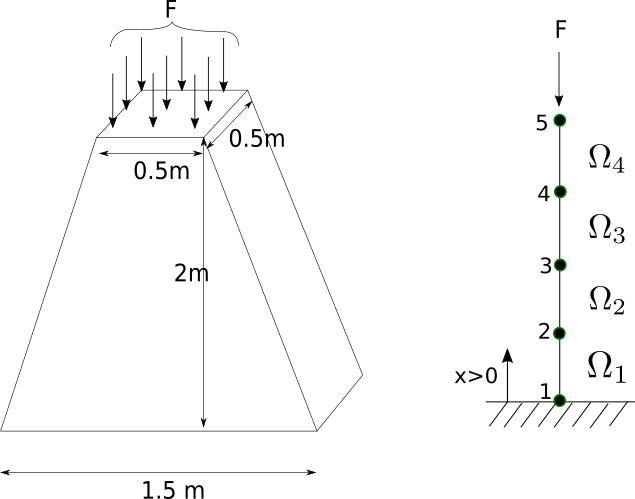

# 2023-24-ex-final. Problem 3

    
 
A column is made of a certain material with Young modulus $R = 181\times
10^{6}$ $\text{kN/m}^{2}$. The geometry of the column is shown in the
figure. We wish to analyze the column for displacements using the FEM.

The column is indeed a three-dimensional structure. However, we wish to
approximate the column as one-dimensional. To this end, we represent the
distributed force at the top of the column as a point force $F = 
5$ $\text{kN}$. 

The weight of the material is represented by the body force per unit
length: 

$$
f(x) = -6.25 ( 3 - x ) \text{kN/m}.
$$

The governing differential equation for the problem is given by:

$$
 -\frac{\text{d}}{\mathrm{d} x}\left(E A (x) \frac{\mathrm{d} u}
  {\text{d} x}\right) = f(x), 
$$

where $A(x)$ is the cross-sectional area. 

Consider a mesh with $4$ linear elements of equal length $h = 0.5$ $\text{m}$.

(a) (3 points) The value $K_{2,3}$ of the stiffness matrix is:

* Empty answer (no penalty)
* `-2.0362e+08 m` 
* `-1.8326e+08 m` 
* `-2.2806e+08 m`
* `-2.2602e+08 m`

(b) (4 points) Compute the approximate solution $u_{\text{appr}}(x)$
at $x = 2$.

* Empty answer (no penalty)
* `-3.5526e-07 m`
* `-3.5849e-07 m`
* `-3.2297e-07 m` 
* `-2.8421e-07 m`

__Hint:__ The approximate solution at $x = 1$ is $u_{\text{appr}}(1) =
-1.8998\times 10^{-7}\, \text{m}$.

\(c\) (3 points) Find the _elongation_ of the last element $\Omega^{4}$
(recall that the elongation is the change in the length of the element).

* Empty answer (no penalty) 
* `-6.0313e-08 m`  
* `-6.7551e-08 m`
* `-6.5138e-08 m`
* `-5.4282e-08 m`
