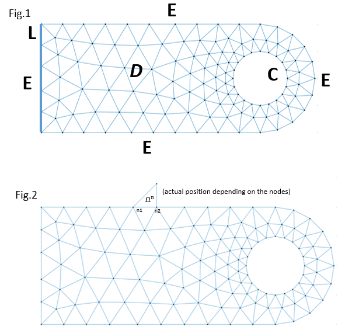

# 2023-24-ex-final. Problem 4
Consider the heat equation $-\Delta T = 0$ on the domain $D$ meshed in the
file `meshDataHoleS5.m` (see Figure 1). Let us define the __interior
boundary__ $C$, as the small circumference inside the domain and the
__exterior boundary__ $E$ as the remaining part of the boundary of the
boundary of $D$ (i.e. $E = \partial\Omega\setminus C$). We also consider
$L$, the left part of $E$, that is, $L = \left\\{(x,y)\in E, x=0, 0\le y\le 2\right\\}$.

<!--
Contonue editing
-->

Let be $P$ the point inside the element $\Omega^{82}$, with barycentric
coordinates $(0.50, 0.25, 0.25)$.

(a) (3 points) Solve the problem when the boundary conditions are: $T\equiv
90$ on $C$, $T\equiv 50$, on $L$. The value of $T(P)$ is:

__Hint a1:__ When no boundary conditions are given, like on $E\setminus L$,
it is equivalent to impose the default condition $q_{n}^{k}\equiv 0$ which is explicitly 
imposed when you initialize $Q = 0$ in the Matlab code.

__Hint a2:__ The value $u(114)$ is `7.1913e+01`

* `7.5778e+01`
* `7.6117e+01`
* Leave it empty (no penalty)
* `7.4604e+01` 
* `7.3212e+01`

(b) (2 points) Consider the same problem with boundary conditions
in the whole exterior boundary $E$ as in (a), but now the temperature on
$C$ be given by $T(x,y) = 25(x - y^{2})$. Then, the value of $T(P)$ is:

__Hint b:__ The value of $u(114)$ is `5.7331e+01`

* `5.7535e+01`
* `5.6370e+01` 
* Leave it empty (no penalty)
* `5.5236e+01`
* `5.6743e+01`

($\text{c}$) \(2 points\) Let us define $B = \\{ (x,y)\in E, x > 3.5 \\}$. Solve the
problem with boundary conditions on $L$ and $C$ as in (b), but now,
considering on $B$ a convection boundary condition with $\beta = 2$ and
$T_{\infty} = 5$. The value of $T(P)$ is then:

__Hint c1:__ $B$ contains $13$ nodes and the node with the largest number
is $55$.

__Hint c2:__ The value of $u(114)$ is `5.3805e+01`

 
