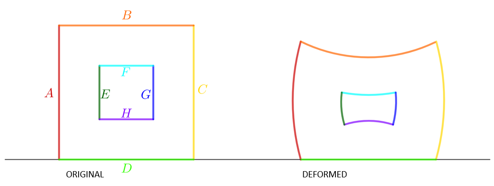

# Final Exam. Course 2023-24 Q1

## Problem 5

Consider the domain determined by the triangular mesh `chimenea2.m`(the
edge lengths are measured in $mm$). The domain is made of an elastic
material with Young modulus $E = 10^{6}$ $\text{N/mm}$$^{2}$, Poisson ratio
$\nu = 0.25$ and thickness $t_{h} = 0.50$ $\text{mm}$. Assume that the boundaries
of the mesh are defined as shown in the image and that the bottom part of
the domain (corresponding to the boundary $D$) is completely fixed and that
we apply a force of $-40000$ $\text{N/mm}$ in the vertical direction on
boundary $B$. Answer the following questions:

(a) (2 points) The number of nodes on the boundary $B\cup E\cup F$ is:

- [ ] `76`
- [ ] Empty answer (no penalty)
- [x] `74` <!---->
- [ ] `73`
- [ ] `75`

__Hint:__ The number of nodes of the boundary $B\cup E\cup F$ of the mesh
`chimenea0.m` is `38`.

(b) (2 points) What is the mean horizontal displacement (in $\text{mm}$) of
the nodes on the boundary $C$?

- [x] `3.5079e-01` <!---->
- [ ] Empty answer (no penalty)
- [ ] `3.5472e-01`
- [ ] `3.3866e-01`
- [ ] `3.4554e-01`

__Hint:__ The horizontal displacement of the node $111$, using the same
parameters and the mesh `chimenea0.m`is `6.7330e-01` $\text{mm}$. 

(c) (3 points) What is the maximum displacement (in $\text{mm}$ and
modulus) of all the nodes?

- [ ] `3.3689e+00`
- [ ] Empty answer (no penalty)
- [ ] `3.2338e+00`
- [ ] `3.2717e+00`
- [x] `3.3244e+00` <!---->
    
__Hint:__ The displacement in modulus of the node $60$, using the same
parameters and the mesh `chimenea0.m`is `3.0387e+00`$\text{mm}$.

(d) (3 points) What is the final area defined by the mesh elements? (This
is the sum of the areas of all the elements after applying the force.)

- [ ] `3.2310e+02`
- [x] `3.1368e+02` <!---->
- [ ] `3.1917e+02`
- [ ] `3.0974e+02`
- [ ] Empty answer (no penalty)

__Hint:__ The area before applying the force is `3.3600e+02`
$\text{mm}^{2}$.
